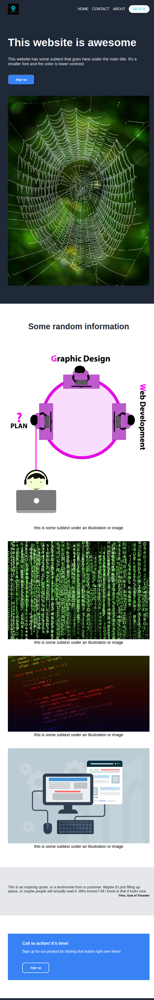
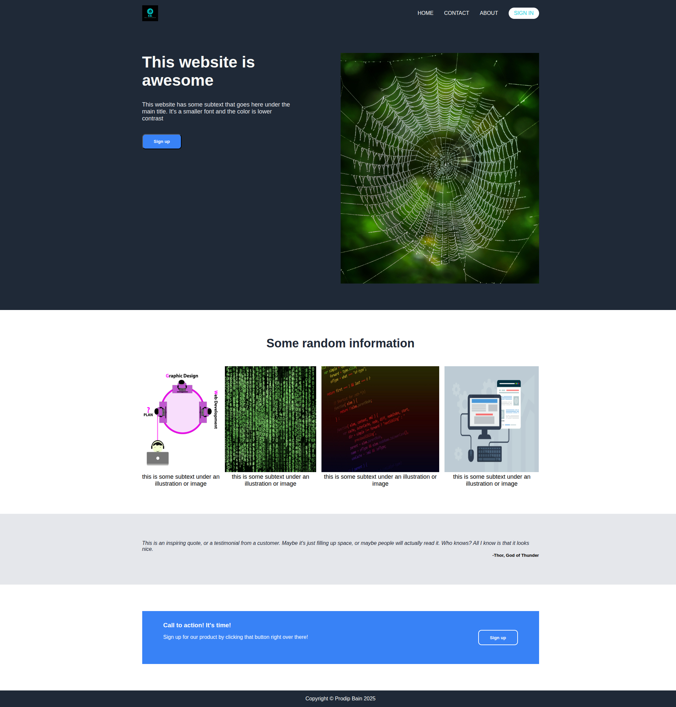

# Project Landing Page

### [Live Demo](https://pbain63.github.io/Project_landing_page/)

## Overview

This is a clean, fully responsive landing page built with HTML5 and CSS3. It's designed to showcase a product, service, or brand with a modern layout and smooth user experience across devices.

The layout emphasizes:

- Visual hierarchy
- Readability
- Responsive design principles

Ideal for:

- Front-end practice
- Portfolio showcase
- Template for personal or business landing pages

## Technologies Used

- **HTML5** — semantic structure
- **CSS3** — modern styling, Flexbox, media queries
- **Responsive Design** — mobile-first and scalable
- **GitHub Pages** — deployment

## Screenshots

Here are a few screenshots demonstrating the responsive design:

### Mobile View (max-width: 700px)

  

### Desktop View

  

## Features

- Mobile-first, fluid layout
- Hero section with CTA (Call to Action)
- Responsive navigation menu
- Sections for services, about, and contact
- Clean and consistent typography

## Getting Started

1. Clone the Repository

git clone https://github.com/pbain63/Project_landing_page.git

2. Open in Browser

Just open index.html in your browser, or use a live server extension for real-time development.

3. Deploy with GitHub Pages

This project is already deployed, but to deploy your own version:

- Go to your repo > Settings > Pages

- Choose main branch and /root

- Save and GitHub will publish your page

## Future Improvements

- Add JavaScript interactivity (e.g., scroll effects, form validation)
- Add animations or transitions
- Integrate with backend or form handler
- Make it a multi-page website

## Contributing

Contributions are welcome:

1. Fork this repo
2. Create a branch (`git checkout -b feature/FeatureName`)
3. Commit changes (`git commit -m 'Add feature'`)
4. Push and open a pull request

## Image copyright (Images collected from pixabay.com):

Albrecht Fietz.jpg - Albrecht Fietz

1.Pranav P.png - Pranav P

2.Jae Rue.jpg - Jae Rue

3.Dok Sev.jpg - Dok Sev

4.Mudassar Iqbal.jpg - Mudassar Iqbal

## License

This project is open source and available under the [MIT License](LICENSE).

---

Made with ❤️ by [Prodip Bain](https://github.com/pbain63)
